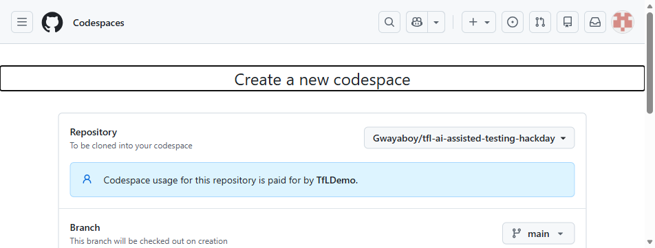
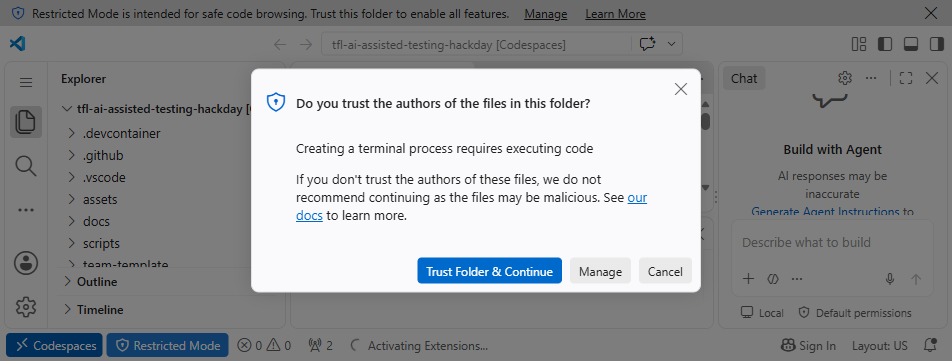
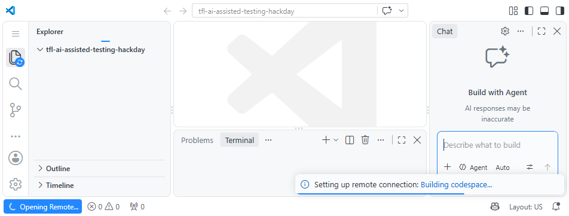
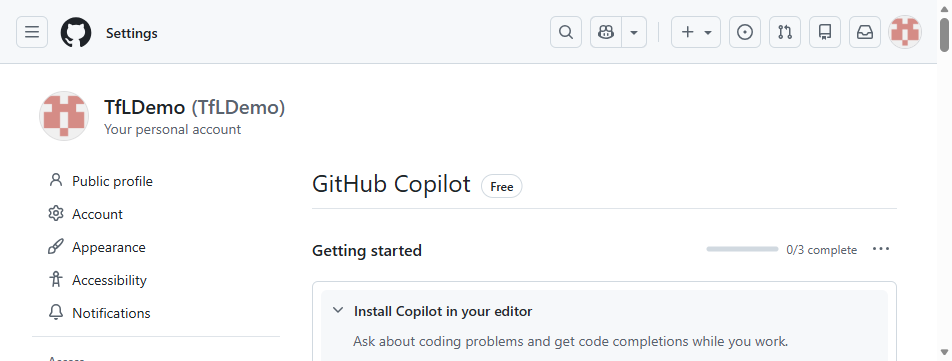

# TfL × Microsoft — AI-Assisted Testing Hack Day

**Tuesday 6 October 2026 · 2 Kingdom Street, London (2KS)**

Welcome! Today is about getting **hands-on** with AI-assisted testing. You'll use
**GitHub Copilot** (agent mode + the Playwright MCP server) to explore an app, design
tests, automate them, and think like a test leader — then share what you learned.

> **Not sure where to start?** Jump to [Setup](#setup) → then
> [Track 1: Functional Testing](./track-1-functional).

> 📢 **Join the live session (6 Oct).** We'll share on-the-day info here — including the
> **Playwright Workspaces token** for the optional cloud regression run — in the
> **[Teams meeting](https://teams.microsoft.com/meet/297126363575245?p=Ulz9HBO5G2YYTck0Fu)**.
> Keep it open during the day; the token is shared there, never committed to this repo.

---

## The day at a glance

| Time | What | Where |
|------|------|-------|
| 09:30 | Arrival, coffee & networking | 2KS reception |
| 10:00 | Welcome & objectives — **form teams, pick names** | Silk, Beech & Fore St |
| 10:15 | How can we use AI to test end to end? | Silk, Beech & Fore St |
| 11:15 | [**Session 1** — AI-assisted functional testing + Regression challenge](./track-1-functional) | Silk, Beech & Fore St |
| 12:40 | Lunch | 4th-floor canteen / local |
| 13:30 | [**Session 2** — Test leadership & governance + Messy project](./track-2-leadership)  | Silk, Beech & Fore St |
| 15:20 | Break | |
| 15:30 | LLM Testing Overview | Silk, Beech & Fore St |
| 16:00 | Team readouts, lessons learned & prizes | Silk, Beech & Fore St |
| 17:00 | Networking  & Close | |

📍 **Room:** all sessions run in **Silk, Beech & Fore Street** — three rooms combined into one cabaret-style space at 2KS, set the same way all day (8 team tables). We'll meet everyone at **2KS reception at 09:30** and walk you in together.

Sessions run **consecutively** — everyone does Session 1 (Track 1) then Session 2 (Track 2).
[**Track 3 — Performance**](./track-3-performance-optional) is an **optional** back-pocket
activity for anyone who wants to go further.

---

## The tracks

| Track | Focus | SUT | Runs where |
|-------|-------|-----|-----------|
| [**1 — Functional**](./track-1-functional) | BDD, Playwright, Copilot-assisted test authoring | Movies app | **100% local** |
| [**2 — Leadership**](./track-2-leadership) | Strategy, assurance, cross-team collaboration | Messy Project brief | Whiteboard / laptop |
| [**3 — Performance** *(optional)*](./track-3-performance-optional) | Load testing, JMeter, Azure Load Testing | Contoso Traders | Cloud (optional) |

Each track has **guided step-by-step labs** (great if you're newer to automation)
**and** open challenges (if you want to push yourself). Do as much or as little as you like.

---

## Setup

> ### ⭐ Preferred: open in GitHub Codespaces (zero install)
> The **easiest** way to take part — nothing to install, works on a locked-down laptop,
> and a **free personal GitHub account is enough**.
>
> ⚠️ **Use a _personal_ GitHub account — not your TfL corporate one.** TfL accounts with a Copilot
> licence can't reach resources outside TfL's GitHub Enterprise (this repo and Codespaces), so
> everyone should use a personal account — whether or not you already have a corporate licence.
>
> 1. **Sign up (free)** at **[github.com/signup](https://github.com/signup)** using a **personal
>    email — not your TfL address**. **Gmail** works smoothly; Outlook.com addresses can occasionally
>    be rejected at the sign-up _"verify email"_ step, so Gmail is the reliable fallback. A free
>    account includes **GitHub Copilot Free** plus **120 Codespaces core-hours + 15 GB storage per
>    month**, plenty for the day — you'll set a username + password and verify via an emailed code.
> 2. On this repo, click **`< > Code` ▸ Codespaces ▸ Create codespace on main**.
>
>    
>    *Create a codespace on the **main** branch of the hack-day repo.*
> 3. **Give it ~10–15 min on first creation.** It happens in two phases: the **editor opens** after
>    ~3–5 min, then a **one-time background setup** keeps running for another ~5–10 min. It
>    auto-installs Node, .NET, the GitHub CLI, **Java + JMeter, the Azure CLI (+ `az load`) and
>    Bicep**, Playwright + Chromium, the VS Code extensions, and the Copilot/Playwright-MCP config —
>    and it **pre-clones and builds the Movies app SUT** for you. The **JMeter download is the slow
>    part**; setup is finished when the terminal prints **`Setup complete`**. If you start the app
>    before that, let it finish first. **Tip:** create the Codespace *before* the day (or first
>    thing) so the wait doesn't eat into hacking time. (**PowerShell** is also installed — pick it
>    from the terminal's **+ ▾** dropdown if you prefer `pwsh` over the default bash.)
>
>    
>    *On first open, click **Trust Folder & Continue** when VS Code prompts.*
>
>    
>    *The one-time background setup runs automatically — it's ready when the terminal prints **`Setup complete`**.*
> 4. **Sign in to GitHub Copilot** in the Codespace (Copilot icon ▸ Sign in). We'll make sure
>    everyone has Copilot access on the day; **[Copilot Free](https://github.com/copilot)** also
>    works on personal accounts.
>
>    
>    *Signed in with your personal account, [github.com/settings/copilot](https://github.com/settings/copilot) should show the **Copilot Free** plan.*
> 5. Start the app and go:
>    ```bash
>    cd ../playwright-movies-app && npm run dev
>    ```
>    When VS Code offers to **open the forwarded port (3000)** in the browser, click it.
>
> 👉 Full Codespaces walkthrough **for every track** (including .NET and performance):
> [`docs/codespaces.md`](./docs/codespaces.md).
>
> 💻 **Best of both worlds:** you can connect your **local VS Code** to the Codespace — cloud
> compute + your own editor, nothing to install locally. See
> [Connect local VS Code to the Codespace](./docs/codespaces.md#6-best-of-both-worlds--connect-your-local-vs-code-to-the-codespace).

Prefer to run everything on your own machine? Follow the local setup below.

### Local setup (alternative)

#### 1. Prerequisites

| Tool | Version | Check |
|------|---------|-------|
| [Node.js](https://nodejs.org/) | 18+ (20 LTS recommended) | `node --version` |
| [Git](https://git-scm.com/) | any recent | `git --version` |
| [VS Code](https://code.visualstudio.com/) | latest | |
| [GitHub Copilot](https://github.com/features/copilot) | active licence, signed in | Copilot icon in VS Code |
| .NET SDK *(only for the C#/Reqnroll path)* | 8+ | `dotnet --version` |

#### 2. Clone this repo

```bash
git clone https://github.com/Gwayaboy/tfl-ai-assisted-testing-hackday.git
cd tfl-ai-assisted-testing-hackday
```

#### 3. Start the System Under Test (SUT) — the Movies app

The primary SUT is the open-source
[**playwright-movies-app**](https://github.com/debs-obrien/playwright-movies-app). It runs
**100% locally** — its movie data and login come from a **bundled mock API**, so there's
**no cloud account, no TMDB/IMDb sign-up and no API key** to worry about.

**Option A — helper script (recommended):**

```bash
# macOS/Linux
./scripts/start-movies-app.sh
```
```powershell
# Windows PowerShell
./scripts/start-movies-app.ps1
```

**Option B — manual:**

```bash
git clone https://github.com/debs-obrien/playwright-movies-app.git
cd playwright-movies-app
npm install                 # also builds the local mock API
cp .env.example .env        # sets the test login (any user/pass also works)
npm run dev                 # starts the mock (:4000) and the app (:3000) together
```

> ℹ️ **Two local ports:** `npm run dev` starts the **mock API on `:4000`** and the
> **Movies app on `:3000`**. Keep both free. You only open **http://localhost:3000** in the
> browser — the app talks to the mock for you.

Open **http://localhost:3000** — you should see the movies load. Test login:
`me@outlook.com` / `12345`.

**Option C — no install at all: use the hosted app 🌐**

Can't launch Codespaces **and** can't install locally (locked-down laptop, no admin)? The Movies
app is also **deployed live** — same app, backed by a **hosted mock**, so search, browse, movie
details and the theme toggle all work with **nothing to install and no local mock**:

**👉 https://debs-obrien.github.io/playwright-movies-app/**

Great for **exploratory testing** (point GitHub Copilot + the Playwright MCP straight at it) or as
a **live target you point your tests at**.

> ℹ️ **A couple of things to know:**
> - The app lives under the path **`/playwright-movies-app/`** (not the domain root) — use the
>   **full URL above** as your base URL.
> - It's a **shared, public, read-only** demo. Perfect for search / browse / details / theme;
>   login-based scenarios (and anything that writes state) are best on the local or Codespaces app.
> - To run either regression baseline against it, set `BASE_URL` — see the
>   [Regression Optimisation challenge README](./track-1-functional/challenge-regression-optimisation/README.md#how-to-run-the-baseline-get-your-before).

✅ **You're ready.** Head to [Track 1](./track-1-functional).

---

## House rules

- **Teams:** Form small teams (6-7). Pick a fun **team name** — you'll present as a team.
- **Objective:** Learn something practical and **share it** in the readout. This isn't about
  building for the sake of it — it's about ideas you can take back to your team.
- **Balance:** Newer to automation? Start with the **guided labs**. Comfortable already?
  Skip ahead to the **challenges** or bring your own scenario.
- **Bring your own use case:** Got a real testing problem? Great — adapt a track to it and
  tell us how you approached it.
- **Ask:** Microsoft CSAs and TfL track coaches are on the floor all day. Wave us over.
- **Have fun & compete:** There's swag. See [scoring](./docs/scoring.md).

---

## Repo map

```
.
├── track-1-functional/              # Functional testing (everyone, AM)
│   ├── 00-warmup-guided/            #   guided first steps
│   ├── 01-gherkin-scenarios/        #   write BDD scenarios
│   ├── 02-bdd-cucumber-js/          #   implement (JS/TS)
│   ├── 02bis-bdd-reqnroll-dotnet/   #   implement (C#) — parallel to 02
│   ├── 03-api-testing/              #   API tests with Playwright (JS/TS)
│   ├── 03bis-api-testing-dotnet/    #   API tests with Playwright (C#) — parallel to 03
│   ├── challenge-regression-optimisation/   # ⚔️ competitive challenge
│   └── prompts/                     #   starter Copilot prompts
├── track-2-leadership/              # Test leadership (everyone, PM)
│   └── messy-project-challenge/     # ⚔️ cross-team collaboration challenge
├── track-3-performance-optional/    # Performance (optional back-pocket)
├── team-template/                   # copy this per team to track your work
├── docs/                            # setup, scoring, facilitator guide
└── scripts/                         # helpers to run the SUT
```

---

## Feedback

At the end of the day, please spend 2 minutes on the feedback form — it genuinely shapes the
next hack. 🙏

**📝 Form:** [forms.cloud.microsoft/r/HtPRpQYjj9](https://forms.cloud.microsoft/r/HtPRpQYjj9)


*Scan the QR code, or use the link above.*

*Built for the TfL × Microsoft AI-Assisted Testing Hack Day. Adapted from the
[Playwright Hands-On Lab](https://github.com/Gwayaboy/PlaywrightHandsOnLab).*
