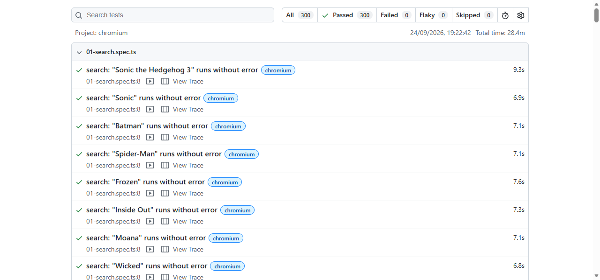

# ⚔️ Challenge — Regression Optimisation

> This is the competitive challenge embedded in **Track 1**, and it tackles a real-world pain:
> **regression optimisation**. When you're staring at hundreds of tests — so many that runs drag
> on — which team can come up with **more coverage in less execution time**?

You're handed a **deliberately slow, bloated regression suite**. Your mission: make it
**faster, leaner and more reliable** — using **GitHub Copilot** — without losing meaningful
coverage.

---

## The brief

The `baseline-suite/` is a real Playwright suite that runs against the local Movies app. It is
**intentionally awful**:

- 🐌 **Serial & single-worker** — no parallelism
- 😴 **Hard-coded `waitForTimeout` sleeps** everywhere
- 🔁 **Duplicated tests** covering the same behaviour multiple times
- 🌐 **Everything through the UI** — even checks that could be fast API calls
- 🪣 **Over-broad tests** that assert little but take long
- ♻️ **No reuse** — every test re-navigates from scratch

It **passes** (mostly green) — it's just slow and wasteful. Sound familiar? 😅

> 🌐 **Two flavours, same challenge — pick your language.** The baseline ships in both
> **JS/TS** ([`baseline-suite/`](./baseline-suite)) and **C#/.NET**
> ([`baseline-suite-dotnet/`](./baseline-suite-dotnet)) — they mirror each other (same ~300
> tests, same anti-patterns, same target app). Use whichever your team lives in.

## Your goal

Produce an **optimised suite** that keeps (or improves) coverage while dramatically cutting
run-time and improving reliability. Then show us a **before / after**.

### You'll compete on ([full rubric](../../docs/scoring.md#-challenge-1--regression-optimisation-in-track-1))

| Criterion | Weight |
|-----------|:------:|
| **Coverage** (meaningful behaviour, not just asserts) | 40% |
| **Execution time** (faster suite) | 30% |
| **Pass rate / reliability** (green & stable) | 20% |
| **How you used AI** (smart prompting, MCP, explainable choices) | 10% |

---

## How to run the baseline (get your "before")

Pick your language — both run against the movies app on `http://localhost:3000`.

**JS / TS** ([`baseline-suite/`](./baseline-suite)):

```bash
cd track-1-functional/challenge-regression-optimisation/baseline-suite
npm install
npx playwright install chromium
# make sure the movies app is running on http://localhost:3000 first!
npm run test:baseline
```

This prints a summary and writes a Playwright HTML report. Open it with `npx playwright show-report`.

**C# / .NET** ([`baseline-suite-dotnet/`](./baseline-suite-dotnet)):

```bash
cd track-1-functional/challenge-regression-optimisation/baseline-suite-dotnet
dotnet build
pwsh bin/Debug/net8.0/playwright.ps1 install chromium
# make sure the movies app is running on http://localhost:3000 first!
dotnet test
```

Either way, **record the total time and test count** — that's your baseline.

### ⏱️ How long should the baseline take?

**Expect ~28–30 minutes** — and that's the point. It's **300 tests on a single worker**, run
serially, stuffed with hard `waitForTimeout` sleeps, with trace + video recording on. On a
typical laptop a clean run lands around **28 min** (the slowest file alone,
`05-details.spec.ts`, is ~6–7 min). If yours is wildly off, check the movies app is up on
`http://localhost:3000` and nothing else is hammering the machine.

> 💡 This slow number is your **"before"**. Note it down, then see how far Copilot can push it.

### What a baseline run looks like

A clean baseline: **300 passed in 28.4 min** on a single worker. Screenshot your own report like
this for the readout:



## Optimise it (with Copilot)

Some high-value moves (let Copilot help, but understand each one):

1. **Turn on parallelism** — `fullyParallel: true`, raise `workers`.
2. **Kill the sleeps** — replace `waitForTimeout` with **web-first assertions**
   (`await expect(locator).toBeVisible()`) that wait only as long as needed.
3. **De-duplicate** — merge redundant tests; use `Scenario`-style parametrisation.
4. **Push checks down the stack** — move pure-data checks from UI to **API tests** (much faster).
5. **Reuse setup** — shared context / storage state instead of re-navigating every test.
6. **Shard** if you want — split across workers/CI.
7. **Prune the truly worthless** — but justify what you cut (coverage matters!).

### Starter prompt

```
This Playwright suite is deliberately slow and redundant. Analyse baseline-suite/ and produce
an optimised version that (a) enables parallelism, (b) replaces waitForTimeout with web-first
assertions, (c) de-duplicates overlapping tests, and (d) moves pure data checks to the API
layer where possible - WITHOUT losing meaningful coverage. Explain each change and show me a
before/after of the projected run-time and test count.
```

See more in [`baseline-suite/ANTIPATTERNS.md`](./baseline-suite/ANTIPATTERNS.md) — a checklist
of everything that's wrong (great to feed Copilot, or to hunt yourself).

---

## What to show at the readout

- **Before:** baseline test count + total time (screenshot the HTML report).
- **After:** optimised count + total time + pass rate.
- **Coverage:** what you kept, what you cut, and *why*.
- **AI story:** the prompts/agents that helped most.

> A clean before/after Playwright HTML report is the perfect evidence.

---

## 🤖 Bonus: go agentic

Chain it into Anusha's [agentic workflow](../../docs/bonus-agentic-workflow.md): have an agent
**run the suite, detect the slow/flaky tests, propose & apply fixes, re-run, and generate a
coverage/timing report** — a self-optimising regression loop. Extra credit for a demonstrable
**self-heal** on a broken locator.
