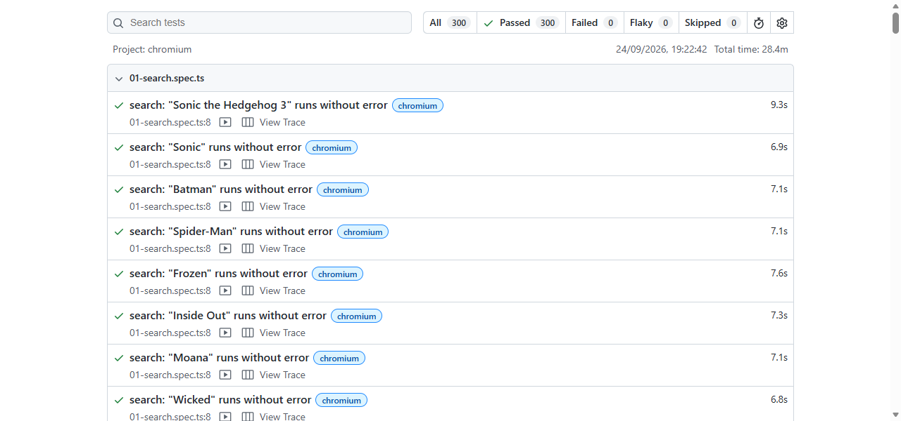

# ⚔️ Challenge — Regression Optimisation

> This is the competitive challenge embedded in **Track 1**, and it tackles a real-world pain:
> **regression optimisation**. When you're staring at hundreds of tests — so many that runs drag
> on — which team can come up with **more coverage in less execution time**?

You're handed a **deliberately slow, bloated regression suite**. Your mission: make it
**faster, leaner and more reliable** — using **GitHub Copilot** — without losing meaningful
coverage.

---

## The brief

The `baseline-suite/` is a real Playwright suite that runs against the local Movies app. It is
**intentionally awful**:

- 🐌 **Serial & single-worker** — no parallelism
- 😴 **Hard-coded `waitForTimeout` sleeps** everywhere
- 🔁 **Duplicated tests** covering the same behaviour multiple times
- 🌐 **Everything through the UI** — even checks that could be fast API calls
- 🪣 **Over-broad tests** that assert little but take long
- ♻️ **No reuse** — every test re-navigates from scratch

It **passes** (mostly green) — it's just slow and wasteful. Sound familiar? 😅

> 🌐 **Two flavours, same challenge — pick your language.** The baseline ships in both
> **JS/TS** ([`baseline-suite/`](./baseline-suite)) and **C#/.NET**
> ([`baseline-suite-dotnet/`](./baseline-suite-dotnet)) — they mirror each other (same ~300
> tests, same anti-patterns, same target app). Use whichever your team lives in.

## Your goal

Produce an **optimised suite** that keeps (or improves) coverage while dramatically cutting
run-time and improving reliability. Then show us a **before / after**.

### You'll compete on ([full rubric](../../docs/scoring.md#-challenge-1--regression-optimisation-in-track-1))

| Criterion | Weight |
|-----------|:------:|
| **Coverage** (meaningful behaviour, not just asserts) | 40% |
| **Execution time** (faster suite) | 30% |
| **Pass rate / reliability** (green & stable) | 20% |
| **How you used AI** (smart prompting, MCP, explainable choices) | 10% |

---

## How to run the baseline (get your "before")

> ▶️ **First, get the Movies app running.** The baseline runs against it on
> `http://localhost:3000`. If it isn't up yet, follow
> **[Setup → Start the SUT (Movies app)](../../docs/setup.md#4-start-the-sut-movies-app)**
> (or the [main README setup](../../README.md#setup)) — in short, from the repo root run
> `./scripts/start-movies-app.sh` (macOS/Linux) or `./scripts/start-movies-app.ps1`
> (Windows PowerShell), which clones, builds and starts it for you. No local install?
> Point the baseline at the **hosted app** via `BASE_URL` instead (see below).

Pick your language — both run against the movies app on `http://localhost:3000`.

**JS / TS** ([`baseline-suite/`](./baseline-suite)):

```bash
cd track-1-functional/challenge-regression-optimisation/baseline-suite
npm install
npx playwright install chromium
# make sure the movies app is running on http://localhost:3000 first!
npm run test:baseline
```

This prints a summary and writes a Playwright HTML report. Open it with `npx playwright show-report`.

**C# / .NET** ([`baseline-suite-dotnet/`](./baseline-suite-dotnet)):

```bash
cd track-1-functional/challenge-regression-optimisation/baseline-suite-dotnet
dotnet build
pwsh bin/Debug/net8.0/playwright.ps1 install chromium
# make sure the movies app is running on http://localhost:3000 first!
dotnet test
```

Either way, **record the total time and test count** — that's your baseline.

> 🌐 **No local app / no Codespaces?** Point the baseline at the **hosted** Movies app instead of
> `localhost:3000` by setting `BASE_URL`:
>
> ```bash
> # JS / TS
> BASE_URL=https://debs-obrien.github.io/playwright-movies-app/ npm run test:baseline
> ```
> ```powershell
> # C# / .NET (PowerShell)
> $env:BASE_URL="https://debs-obrien.github.io/playwright-movies-app/"; dotnet test
> ```
>
> The hosted app is backed by a **shared public mock** — fine for a one-off baseline run, but the
> local/Codespaces app is faster and kinder to the shared instance.

### ⏱️ How long should the baseline take?

**Expect ~28–30 minutes** — and that's the point. It's **300 tests on a single worker**, run
serially, stuffed with hard `waitForTimeout` sleeps, with trace + video recording on. On a
typical laptop a clean run lands around **28 min** (the slowest file alone,
`05-details.spec.ts`, is ~6–7 min). If yours is wildly off, check the movies app is up on
`http://localhost:3000` and nothing else is hammering the machine.

> 💡 This slow number is your **"before"**. Note it down, then see how far Copilot can push it.

### What a baseline run looks like

A clean baseline: **300 passed in 28.4 min** on a single worker. Screenshot your own report like
this for the readout:



## Optimise it (with Copilot)

Some high-value moves (let Copilot help, but understand each one):

1. **Turn on parallelism** — `fullyParallel: true`, raise `workers`.
2. **Kill the sleeps** — replace `waitForTimeout` with **web-first assertions**
   (`await expect(locator).toBeVisible()`) that wait only as long as needed.
3. **De-duplicate** — merge redundant tests; use `Scenario`-style parametrisation.
4. **Push checks down the stack** — move pure-data checks from UI to **API tests** (much faster).
5. **Reuse setup** — shared context / storage state instead of re-navigating every test.
6. **Shard** if you want — split across workers/CI.
7. **Prune the truly worthless** — but justify what you cut (coverage matters!).

### Starter prompt

```
This Playwright suite is deliberately slow and redundant. Analyse baseline-suite/ and produce
an optimised version that (a) enables parallelism, (b) replaces waitForTimeout with web-first
assertions, (c) de-duplicates overlapping tests, and (d) moves pure data checks to the API
layer where possible - WITHOUT losing meaningful coverage. Explain each change and show me a
before/after of the projected run-time and test count.
```

See more in [`baseline-suite/ANTIPATTERNS.md`](./baseline-suite/ANTIPATTERNS.md) — a checklist
of everything that's wrong (great to feed Copilot, or to hunt yourself).

---

## ☁️ Scale on Microsoft Playwright Workspaces (optional)

Once your suite is lean locally, run it on **cloud-hosted browsers** with **Microsoft Playwright
Workspaces** (Azure App Testing) — fan out to **20+ parallel workers** and across multiple
browsers/OSes without owning the machines. It's the last big lever on the **execution-time**
score, and the scorer treats a cloud run exactly like a local one.

A ready-to-use `playwright.service.config.ts` + `.env.example` ship in
[`baseline-suite/`](./baseline-suite), and there's a `npm run test:mpt` script wired up:

```bash
cd baseline-suite
npm install                       # pulls @azure/playwright, @azure/identity, dotenv
cp .env.example .env              # paste the workspace endpoint the organiser gives you
az login                          # Microsoft Entra ID auth (or use an access token)
npm run test:mpt                  # playwright test --config=playwright.service.config.ts --workers=20
```

👉 Full walkthrough (auth options, local-SUT `exposeNetwork`, and organiser setup on a personal
Azure subscription): **[MICROSOFT-PLAYWRIGHT-TESTING.md](./MICROSOFT-PLAYWRIGHT-TESTING.md)**.

---

## 🧮 Objective scoring (`score.mjs`)

To keep judging **fair and reproducible**, this challenge ships a scorer that reads the
Playwright **JSON** reports from your before/after runs and computes the objective 90% of the
rubric (Coverage 40 · Time 30 · Reliability 20); the AI-use 10% stays a judge's manual mark.

Both the baseline config **and** any suite you copy it from already emit a `results.json` next
to the HTML report (see the `json` reporter in `playwright.config.ts`), so scoring is turnkey:

```bash
# 1) baseline "before" (writes baseline-suite/results.json)
cd track-1-functional/challenge-regression-optimisation/baseline-suite
npm run test:baseline

# 2) your optimised "after" (your suite's config also writes results.json)
cd ../your-optimised-suite
npx playwright test

# 3) score it (from the challenge folder)
cd ..
node score.mjs \
  --baseline baseline-suite/results.json \
  --optimised your-optimised-suite/results.json \
  --ai 8            # judge's 0–10 mark for "how you used AI"
```

You'll get a scorecard like:

```
  Speed-up                               324.1×  (100% faster)
  Coverage of required behaviours (passing tests):
    [x] Search returns matching results      [x] Browse / landing renders movies
    [x] Search with no matches shows empty   [x] Movie details render
    [x] Empty query keeps browsable list     [x] Dark / light theme toggles
    → 6/6 behaviours covered
  Weighted score  Coverage 40 · Time 30 · Reliability 20 · AI 8  →  TOTAL 98 / 100
```

**Coverage is measured against a fixed list of required behaviours**, so you can't win on time
by simply deleting tests — dropping a behaviour costs coverage points. Tag your tests with
`@covers:<id>` (`search-exists`, `search-none`, `search-empty`, `browse`, `details`, `theme`)
for exact attribution, or rely on title-keyword matching. Add `--json` for a machine-readable
scorecard. This tool scores the **JS/TS** Playwright JSON; .NET teams report the same three
numbers from their `dotnet test` run.

---

## What to show at the readout

- **Before:** baseline test count + total time (screenshot the HTML report).
- **After:** optimised count + total time + pass rate.
- **Coverage:** what you kept, what you cut, and *why*.
- **AI story:** the prompts/agents that helped most.

> A clean before/after Playwright HTML report is the perfect evidence.

---

## 🤖 Bonus: go agentic

Chain it into Anusha's [agentic workflow](../../docs/bonus-agentic-workflow.md): have an agent
**run the suite, detect the slow/flaky tests, propose & apply fixes, re-run, and generate a
coverage/timing report** — a self-optimising regression loop. Extra credit for a demonstrable
**self-heal** on a broken locator.
