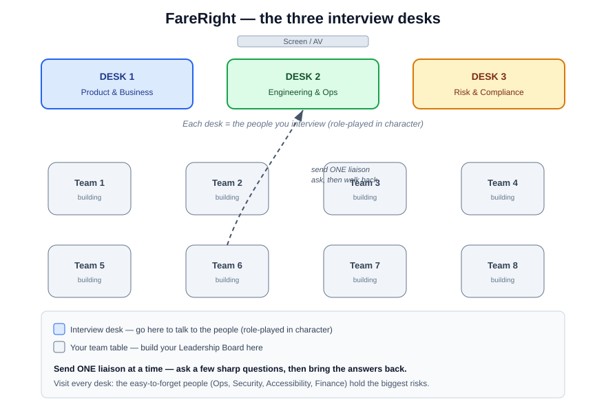

# Who's who — the people you talk to

Information about FareRight is **siloed** across six stakeholders. To keep it simple, they sit at
**three interview desks**. Send your **liaison** to a desk to unlock what those people know — just
like a real test lead chasing down the picture.

> 🎭 **These FareRight stakeholders are played by your Microsoft coaches, in character,** at one
> of the three desks ("Layer ②" in the
> [Track 2 overview](../../README.md#how-the-room-works-three-layers)). Send **one liaison** per
> trip; don't crowd the desk.

> 💡 Scoring hint: teams that **seek out the easy-to-forget people** (Ops, Security, Accessibility,
> Finance) score higher on collaboration — and find the risks that sink a public money service.

*The room at a glance: three interview desks up front, your team tables in the middle. Send one liaison to a desk, ask, and bring the answers back.*

## The three interview desks

Each desk is run by its **two Microsoft coaches**, who play the FareRight stakeholders below:

### 🟦 Desk 1 — Product & Business
| Who — your Microsoft coach | Holds the key to… |
|------|-------------------|
| **Milo Farrell** — Product Owner | the vision, the demo deadline, scope calls |
| **Ryan Byrne** — Exec Sponsor | the big-picture vision and exciting "wouldn't-it-be-cool" ideas for where FareRight could go |

### 🟩 Desk 2 — Engineering & Ops
| Who — your Microsoft coach | Holds the key to… |
|------|-------------------|
| **Leo Durrant** — Engineering (backend + frontend) | the overnight-batch reality & refund mechanics, false positives, the flaky outage feed, idempotency, the misleading "instant" copy & query-flow gap |
| **Franck Theolade** — Operations & Reliability ⚠️ | volumes, batch window, peak-day load, reconciliation |

### 🟥 Desk 3 — Risk & Compliance
| Who — your Microsoft coach | Holds the key to… |
|------|-------------------|
| **Ajil Jins** — Security & Compliance ⚠️ | fraud, PII, auditability, the cap-vs-auto-refund conflict |
| **Najmah Mohamed** — Accessibility & Finance ⚠️ | legal a11y requirements for public money-moving screens; reconciliation, refund approval, false-positive cost |

> ⚠️ = easy to forget, high impact. A good lead goes looking for them.

## A word of warning 🙃

**Stakeholders aren't always right, and they don't always agree with each other.** Some of what
you hear is out of date, over-ambitious, or flatly contradicted by someone at another desk — and
not everything you're asked for truly belongs in the MVP. Part of leadership is **spotting
the conflicts and deciding what's actually true** — don't just write down the first thing you're
told. Finding and resolving those contradictions is the heart of the challenge.
