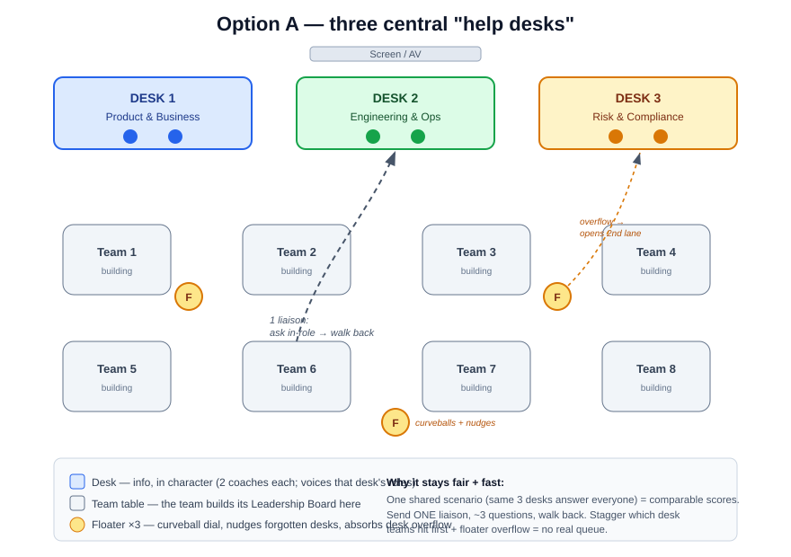

# Facilitator run-sheet — Messy Project (Track 2)

A one-page, minute-by-minute of how the Messy Project activity runs on the day.
Pairs with [`curveballs.md`](./curveballs.md) (the timed injects) and
[`model-answer.md`](./model-answer.md) (judging aid). Participant brief:
[`../README.md`](../README.md).

> **Shape:** Session 2 runs **13:30–15:20**; readouts at **16:00** (after the 15:30 LLM Testing
> Overview). It's **one activity** —
> every team runs the **same FareRight scenario in parallel** and competes. Teams do **not**
> depend on each other; the "other teams" they consult are the **facilitator-played roles** at
> **three interview desks** (Product & Business · Engineering & Ops · Risk & Compliance).
>
> **The loop teams run:** 🗣️ interview a desk → 📝 update their one-page Leadership Board → 📣 adapt
> to a curveball → repeat → present. Keep it that simple.

## At a glance

| Time | Phase | Facilitators do | Teams do |
|------|-------|-----------------|----------|
| 13:30 | Framing (~10–15 min) | Frame test leadership; open the **3 desks**; explain the loop | Pick lanes; start the **Leadership Board** |
| 13:45 | Challenge starts — **T+0** | Hold the 3 desks (**2 each**); **3 floaters** run the curveball dial & absorb desk overflow | Loop: interview a desk → update the board |
| ~14:05 | **Curveball 1** (default) | Drop *"demo moved up — half the time"* | Cut to a minimum viable scope; state residual risk |
| ~14:30 | **Curveball 2** (default) | Drop *"false-positive bomb: 8,000 wrong refunds"* | Assurance story; idempotency/data-quality thinking |
| as needed | **Extra curveballs** *(optional)* | Only if a team's flying: *misleading 'refunded' copy* · *unowned query button* · *strike/peak day 10× volume* | Re-prioritise |
| ~15:15 | Wrap | Note scores-in-progress | Finalise the board (= the 3 deliverables) |
| 15:20 | Break | — | — |
| 15:30 | LLM Testing Overview *(separate talk)* | — | — |
| 16:00 | Readouts (5–7 min/team) | Judge with the quick checklist | Present the board — "safe to ship?" |

> 🎚️ **Curveballs are a dial, not a script.** Default to **two** (1 + 2). Throw more only if a team
> is racing ahead; let a struggling team wrestle the basics (security, accessibility) with a nudge,
> not a new problem.

## Step by step

1. **Framing (13:30).** Short intro: what test *leadership* is (strategy, risk, assurance,
   driving the non-functional picture). Set the scene: a project already in motion and in a mess.
   **Explain the loop and the 3 desks** so everyone knows the rules before they start.
2. **Assign the lanes.** Each team picks: **team lead** (time, decisions, readout) ·
   **requirements liaison** (works the desks) · **risk lead** (risk matrix) ·
   **strategy lead** (test strategy) · **curveball wrangler** (catches injects). 3 people → double up.
3. **Drop the brief (13:45 · T+0).** Hand out **FareRight** + point them at the artifacts and a
   blank **Leadership Board**. Open the 3 desks.
4. **They run the loop.** 🗣️ liaison **interviews a desk** → 📝 team **updates the board** (risks,
   strategy, open questions) → repeat. Copilot is fair game to summarise artifacts and sharpen
   questions. They'll quickly find the story doesn't add up — that's the point.
5. **Hold the desks in character.** Answer the liaison's questions **in role**; let them **discover**
   the contradictions (don't hand them over). **One liaison per team — don't let a desk get mobbed.**
6. **Build in parallel.** While the liaison is out: risk lead ranks the matrix, strategy lead drafts
   functional **and** non-functional, lead preps the readout, wrangler stays alert.
7. **Throw a curveball (default 2).** The floating facilitator drops **Curveball 1** (~14:05) and
   **Curveball 2** (~14:30). Teams **re-prioritise**; the lead states what's dropped and the residual
   risk. **Reward adaptation, not a perfect untouched plan.** More curveballs only if a team's flying.
8. **Converge (~15:15).** The board **is** the three deliverables: ① prioritised **risk matrix**
   ② **test strategy** (functional + non-functional, data, entry/exit) ③ the **"safe to ship?"** call.
9. **Readout (16:00 · 5–7 min/team):** top-3 risks · strategy in a nutshell · how curveballs were
   handled · the safe-to-ship assurance story.

## The three interview desks

A facilitator does **one of two jobs** — be clear which is yours:

- **① Desk actor** — you sit at a desk and voice its roles **in character** (ham it up). You're the
  "other team" the liaison consults. Let them discover the contradictions; don't hand them over.
- **② Floating coach** — you float across a **cluster of ~2–3 teams**, run the **curveball dial**,
  keep energy up, unblock, and nudge Copilot-as-copilot use. You're yourself, not a character.

**Three desks — a facilitator voices all the roles at each desk** (staff **two per desk** on the day — see **Room setup** below):

| Desk | MS coaches on the day | Roles voiced | The truth (and traps) they hold |
|------|----------------------|--------------|---------------------------------|
| **1 · Product & Business** | **Milo Farrell · Ryan Byrne** | Priya (PO) + **Blake** (exec sponsor — *noise*) | vision & deadline, scope calls, **+ unreasonable non-MVP asks to say no to** |
| **2 · Engineering & Ops** | **Leo Durrant · Franck Theolade** (Franck also floats) | Tom, Raj, Sara (devs) + Dan (Ops) | overnight batch vs "instant", false positives, idempotency, peak-day load |
| **3 · Risk & Compliance** | **Ajil Jins · Najmah Mohamed** | Marcus (Security), Nadia (Accessibility), Fran (Finance) | IDOR/audit/PII, a11y law, the **£25 cap vs auto-refund** conflict, false-positive cost |

- The **legacy wiki spec (`07`) is a stale trap** — seed it as a document, no desk.
- **MS coaches staff the three desks two-each** (names in the table above); **TfL coaches** pair in for real context, and spare hands **float**.
- **Floor is 3** (one per desk) + a floater (**planned day: 2 per desk + 3 floaters** — see Room setup). **Really short-handed?** One person runs two desks —
  just say **which role you are** each time. **Plenty of crew?** Split Desk 3 (Security/Accessibility
  vs Finance).
- **One liaison per team** at a desk — reward sharp questions; don't let teams mob a desk.

### 🙃 The "noise" role — Blake (exec sponsor)
Play Blake with enthusiasm and zero judgement: *"Could we add a **social feed** so passengers share
their refunds? Can we make sure it handles **700 million users**? What's our **Singapore latency**?
Oh — and everything should be **manually tested**, just to be safe."* None of it is MVP. The test:
does the lead **push back, descope, and justify** — or meekly write it all down? Reward teams that
challenge Blake.

## Room setup & avoiding queues

The room (**Silk, Beech & Fore St** combined) is **cabaret — 8 team tables**. Keep the **3 desks
central**, near the screen, so the room *is* the game: **the info lives at the desks; teams come to
it.** Don't embed a coach at each table — that spoon-feeds the info and kills the "go find it"
collaboration mechanic (worth **30%**).

> 🎪 **Mental model — a careers fair.** Teams build at their tables; when they need something they
> send **one liaison** to walk up to the right desk, ask a couple of questions in character, and walk
> back. The **same 3 desks answer every team**, so everyone runs **one consistent, fair scenario**.



```text
             [ Screen / AV ]
   +--------+   +--------+   +--------+
   | Desk 1 |   | Desk 2 |   | Desk 3 |
   |Prod&Biz|   |Eng&Ops |   |Risk&Cmp|
   |  (x2)  |   |  (x2)  |   |  (x2)  |
   +--------+   +--------+   +--------+

     T1  T2  T3  T4      <- 8 cabaret tables
     T5  T6  T7  T8      <- one liaison leaves to visit a desk
       ~ floaters roam the tables (curveball dial + desk overflow) ~
```

**Planned crew: 9 → 2 per desk + 3 floaters.** With 8 teams that keeps the queue near-zero:

- **2 per desk** — one stays **in character**; the **second chair** takes the next liaison in line
  (or opens a parallel lane) so nobody waits. Quiet desk? The second chair floats.
- **3 floaters = dynamic overflow** — they run the curveball dial and keep energy up, **and** when a
  desk backs up a floater becomes a temporary **2nd instance** of it.
- **Stagger the first visit** — point teams at **different desks first** (T1–3 → Desk 1, T4–6 →
  Desk 2, T7–8 → Desk 3). They desync instantly — no T+0 stampede.
- **One liaison, ~3 sharp questions, then back** — floaters enforce gently. A **short** wait is fine
  and realistic (the busy Security person *is* busy); a **>2-min** queue = send a floater to open a
  second lane.
- **Most of the detail lives in the [`artifacts/`](../artifacts)** — desks only hold the **spoken
  contradictions**, so teams don't all need every desk at once. Demand spreads itself.

## Live Azure DevOps project (facilitator demo — optional)

The messy backlog and the stale legacy spec are also set up as an **Azure DevOps project** that
mirrors the [`artifacts/`](../artifacts) — a **facilitator asset** that makes the mess feel real
(real work items, a real wiki) and shows off a **GitHub Copilot + Azure DevOps MCP** triage. Only
the **deliberately messy** material is in ADO; the **persona-held truth stays with you** (off ADO),
so the collaboration mechanic is intact.

- It's a **private org instance** — **public/anonymous browsing isn't available** (Azure DevOps
  retired public projects). So use it as a **facilitator demo**: show it on the big screen during
  framing, and pull it up when a team's liaison consults a persona.
- The **facilitator/contributor crew** has access (added to the org); give the **project link via
  the contributors chat / the day's Teams meeting — it is NOT committed to this public repo**.
- **Teams self-serve via the markdown [`artifacts/`](../artifacts)** — the canonical source. If you
  skip ADO entirely, nothing is lost.

## Judging (per team) — keep it simple

Four things, out of 100 — a quick gut check per team, no complex maths:

- ☐ **Collaboration (30)** — did they seek out the **easy-to-forget desks** (Ops, Security,
  Accessibility, Finance) rather than just the PO?
- ☐ **Prioritisation (25)** — a clear, **justified top-3 risk**, not boil-the-ocean?
- ☐ **Curveballs (25)** — did they **re-prioritise calmly** and state the residual risk?
- ☐ **Communication (20)** — a crisp **"safe to ship?"** story at the readout?

Want detail? The [printable scoring sheet](../../../docs/facilitator-guide.md#printable-scoring-sheet-per-team)
and the [model answer](./model-answer.md) have it — but the checklist above is enough to run the day.

> 👥 **Judge as a panel.** At the readouts, the **desk coaches + floaters huddle and score together** —
> compare notes, calibrate, and agree each team's four numbers. One shared bar across all teams = fair
> results everyone trusts.

## Facilitator reminders

- **Send a liaison, don't crowd** — reward the sharpest questions.
- **Nudge quiet teams** toward the forgotten roles at **Desk 2 (Ops)** and **Desk 3 (Security,
  Accessibility, Finance)** — by **~T+45**, if a team still hasn't hit **Accessibility or Finance**,
  drop a hint; it's the easiest collaboration points to leave on the table.
- **Watch the traps:** planning from the legacy spec; believing "instant"; ignoring the £25 cap
  conflict; forgetting accessibility; **swallowing Blake's non-MVP asks** without pushback.
- **Reward adaptation** over a beautiful plan that never changes.
- **Ham up the desks** — the role-play is half the fun. 🎭
